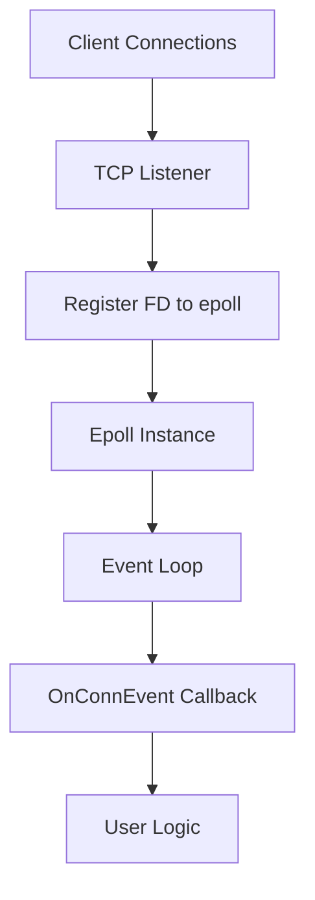
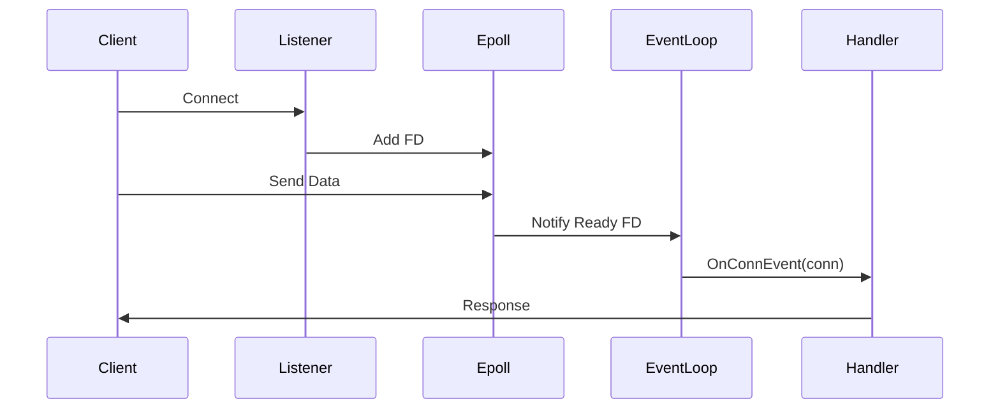

# tcpio

`tcpio` is a lightweight, high-performance TCP server library for Go
that leverages Linux **epoll** for efficient, event-driven I/O handling.

It is designed for building scalable network servers with minimal
overhead by avoiding blocking I/O and using a single event loop for
managing multiple connections.

---

## ✨ Features

- ⚡ Event-driven architecture using epoll
- 🔌 Efficient handling of thousands of TCP connections
- 🧵 Minimal goroutine usage (single event loop model)
- 🛠 Simple and flexible callback-based API
- 🐧 Optimized for Linux systems

---

## 📦 Installation

```bash
go get github.com/rabbit-backend/tcpio
```

---

## 🚀 Getting Started

### Basic Example

```go
package main

import (
    "fmt"
    "net"

    "github.com/rabbit-backend/tcpio"
)

func main() {
    listener, err := tcpio.Listen(&tcpio.ListenerOptions{
        Addr: ":8080",
        OnConnEvent: func(conn net.Conn) error {
            buf := make([]byte, 1024)
            n, err := conn.Read(buf)
            if err != nil {
                return err
            }

            fmt.Println("Received:", string(buf[:n]))
            conn.Write([]byte("OK\n"))
            return nil
        },
        OnErrorEvent: func(err error) {
            fmt.Println("Error:", err)
        },
    })

    if err != nil {
        panic(err)
    }

    listener.Start()
}
```

---

## 🧠 Architecture Overview



---

## 🔄 Event Flow



---

## 🧩 Components

### 1. Listener

- Wraps a standard TCP listener
- Accepts incoming connections
- Registers connections with epoll
- Starts the event loop

### 2. Event Loop

- Runs continuously
- Waits on `epoll_wait`
- Dispatches events to handlers

### 3. Epoll Layer

- File descriptor registration
- Event polling
- Connection tracking

---

## ⚙️ API Reference

### `Listen(options *ListenerOptions) (*Listener, error)`

```go
type ListenerOptions struct {
    Addr         string
    OnConnEvent  func(conn net.Conn) error
    OnErrorEvent func(error)
}
```

---

### `(*Listener) Start()`

Starts accepting connections and launches the event loop.

---

### `(*Listener) GetListener()`

Returns the underlying `*net.TCPListener`.

---

## ⚠️ Important Notes

- Linux only (epoll-based)
- Returning error from handler closes connection
- Avoid blocking operations in callbacks

---

## 📊 When to Use

### ✅ Use Cases

- High-performance TCP servers
- Real-time systems
- Chat servers, proxies, gateways

### ❌ Avoid If

- Cross-platform support needed
- Simplicity preferred over performance

---

## 🚧 Future Improvements

- Edge-triggered epoll
- Connection timeouts
- TLS support
- Better abstractions

---

## 📄 License

MIT License

---

## 🤝 Contributing

PRs and issues welcome.
